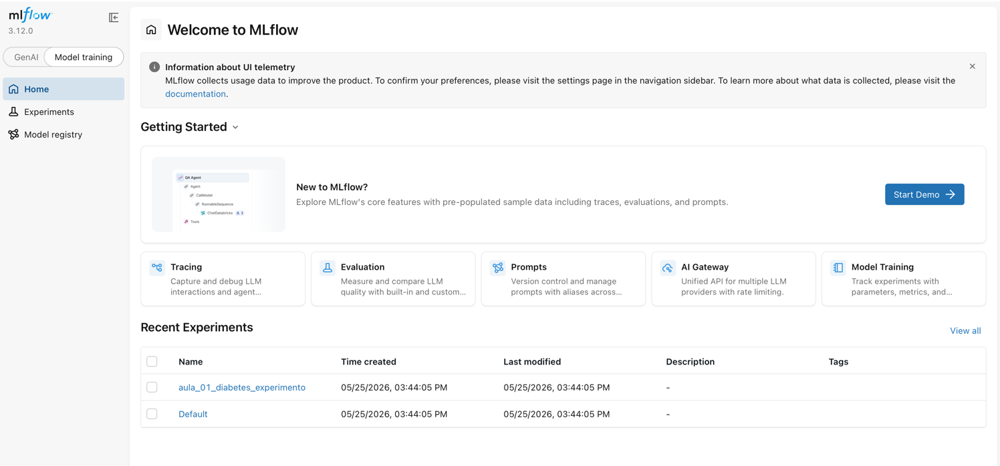

# Aula 01 - Usando MLFlow

Considerando um instalação local do Python, crie uma pasta e inicie um venv (ou equivalente). Para o teste foi criado um abiente com Python **3.11.8**.
Em seguinda, os próximos passos são necessários para termos um exemplo mínimo de uso do MLFlow.

## Step 1: Install MLflow

```
pip install --upgrade "mlflow>=3.1"
```

## Step 2: Configure Tracking

Dentro de um arquivo .py dentro da raiz do diretório criado e com o ambiente virtual ativo, cole o código abaixo:

```py
import mlflow

mlflow.set_tracking_uri("sqlite:///mlflow.db")
mlflow.set_experiment("aula_01_diabetes_experimento")
```

## Step 3: Verify Your Connection

Adicione o código abaixo no arquivo .py e execute-o com `python <arquivo>.py`

```py
import mlflow

# Print connection information
print(f"MLflow Tracking URI: {mlflow.get_tracking_uri()}")
print(f"Active Experiment: {mlflow.get_experiment_by_name('aula_01_diabetes_experimento')}")

# Test logging
with mlflow.start_run():
    mlflow.log_param("test_param", "test_value")
    print("✓ Successfully connected to MLflow!")
```

## Step 4: Access MLflow UI

Para acessar o interface do MLFlow, execute o comando abaixo no terminal:

```bash
mlflow server --backend-store-uri sqlite:///mlflow.db --port 5000
```

Verifique a saída no console para obter o link da interface servida localmente, provavelmente http://127.0.0.1:5000
Ao acessar a interface, deve ser visto algo como a figura abaixo:


Como pode ser visto, na lsita recente de experimentos, há um nominado "aula_01_diabetes_experimento".